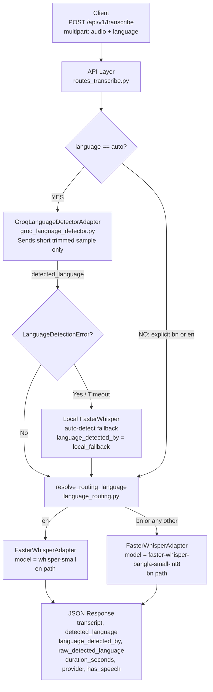

# Speech & Document Extraction — Celloscope AI Service

A production-style speech transcription API built with **FastAPI** and **faster-whisper**, featuring **CUDA GPU acceleration**, Groq-powered language detection, Clean Architecture, and an Adapter pattern.

---

## Architecture — Two-Stage Pipeline



**Why Groq for detection only, not transcription?**
Groq's hosted Whisper gives fast, accurate language identification from a short sample (≤12 s). Only that sample is sent to Groq — the full audio stays local. Once the language is known, the appropriate fine-tuned local model handles transcription, keeping all audio data on-premise and avoiding per-token Groq costs at transcription scale.

**Default-to-Bangla policy:**
Any detected language that is not exactly English (`"en"`) routes to the Bangla fine-tuned model. This is a deliberate policy for a product whose non-English traffic is overwhelmingly Bangla. Hindi, Spanish, and other audio will be transcribed by the Bangla model and may produce degraded output — see `DECISIONS.md` ADR #7 for full rationale.

### Layer separation

```
api/  →  services/  →  adapters/
```

- **Dependencies point inward only.**
- **Services Layer**: Pure business & validation logic — zero FastAPI imports. See [`app/services/README.md`](app/services/README.md).
- **Adapters Layer**: Interface in `app/adapters/base.py`. `faster_whisper` is strictly isolated within `faster_whisper_adapter.py`. Groq I/O is isolated within `groq_language_detector.py`.
- **Lazy Provider Loading**: Each local Whisper model loads on first use for that language — never both simultaneously (4 GB VRAM budget).

---

## Features

- ⚡ **Two-Stage ASR Pipeline**: Groq language detection → local faster-whisper transcription routed by language.
- 🌐 **Groq Language Detection**: Fast hosted Whisper language ID from a short audio sample — with hard timeout and local fallback.
- 🔤 **Binary Routing**: English → `whisper-small`; everything else → `faster-whisper-bangla-small-int8`.
- 🔄 **Automatic Hardware Fallback**: Seamlessly falls back from CUDA to CPU if GPU is unavailable.
- 🎭 **Mock Provider**: Zero-dependency offline mock for development and CI testing.
- 🛡️ **Robust Validation & Error Handling**: Strict file extension, file size (max 25 MB), and audio container validation with structured JSON errors.
- 🤫 **Silence & Ambient Noise Handling**: Returns HTTP 200 with `has_speech: false` — never hallucinates or raises errors.
- 📊 **Detection Provenance**: New `language_detected_by` and `raw_detected_language` fields show exactly how the language was determined.

---

## Quick Start (Local Setup)

### 1. Activate Virtual Environment & Install Dependencies

```powershell
# Activate virtual environment
.\venv\Scripts\activate

# Install dependencies
pip install -r requirements.txt
pip install nvidia-cublas-cu12 nvidia-cudnn-cu12 nvidia-cuda-nvrtc-cu12
```

### 2. Configure Environment (`.env`)

Copy `.env.example` to `.env` and fill in your values:

```env
TRANSCRIBE_PROVIDER=faster_whisper
WHISPER_MODEL=small
WHISPER_MODEL_BN=pretrained_models/faster-whisper-bangla-small-int8
WHISPER_DEVICE=cuda
WHISPER_COMPUTE_TYPE=default
MAX_UPLOAD_MB=25

# Groq language detection (Stage 1)
GROQ_API_KEY=gsk_your_key_here
GROQ_MODEL=whisper-large-v3-turbo
ENABLE_REMOTE_LANGUAGE_DETECTION=true
LANGUAGE_DETECTION_TIMEOUT_SECONDS=8.0
LANGUAGE_DETECTION_SAMPLE_SECONDS=12.0
```

> ⚠️ **Never commit your real `GROQ_API_KEY`** — `.env` is gitignored.

### 3. Run the API Server

```powershell
uvicorn app.main:app --reload
```

Server will start at: `http://127.0.0.1:8000`

---

## Testing & API Documentation

### Interactive Swagger UI
Open **[http://127.0.0.1:8000/docs](http://127.0.0.1:8000/docs)** to test endpoints interactively.

### Running the Test Suite

```powershell
pytest tests/test_transcribe_api.py -v
```

Tests cover (37 tests, ~1 s with mock provider):
- **Validation**: File extension rules and 25 MB size limits.
- **Routing**: `resolve_routing_language` full truth-table (en, bn, hi, es, empty, unknown).
- **Service**: Two-stage pipeline with Groq mocked; fallback on timeout/error.
- **API Integration**: End-to-end endpoint tests for success, silence, invalid formats, language validation, and new schema fields.

---

## API Specification

### `POST /api/v1/transcribe`

**Content-Type:** `multipart/form-data`

| Form Field | Type       | Required | Default  | Allowed Values / Description               |
|------------|------------|----------|----------|---------------------------------------------|
| `audio`    | UploadFile | Yes      | —        | `.wav`, `.mp3`, `.m4a`, `.flac`, `.ogg`     |
| `language` | string     | No       | `"auto"` | `"bn"`, `"en"`, or `"auto"` (auto-detect)  |

#### Sample Success Response — auto-detect via Groq (HTTP 200)

```json
{
    "transcript": "author of The Danger Trail, Philip Steele's, etc.",
    "detected_language": "en",
    "duration_seconds": 3.3,
    "provider": "faster-whisper-small (cuda)",
    "has_speech": true,
    "language_detected_by": "groq",
    "raw_detected_language": "en"
}
```

#### Sample Success Response — Groq detected Hindi, routed to Bangla model (HTTP 200)

```json
{
    "transcript": "...",
    "detected_language": "bn",
    "duration_seconds": 5.1,
    "provider": "faster-whisper-pretrained_models/faster-whisper-bangla-small-int8 (cuda)",
    "has_speech": true,
    "language_detected_by": "groq",
    "raw_detected_language": "hi"
}
```

#### Sample Success Response — explicit language (HTTP 200)

```json
{
    "transcript": "আমি বাংলায় কথা বলছি।",
    "detected_language": "bn",
    "duration_seconds": 4.2,
    "provider": "faster-whisper-pretrained_models/faster-whisper-bangla-small-int8 (cuda)",
    "has_speech": true,
    "language_detected_by": "user_specified",
    "raw_detected_language": null
}
```

#### Sample Silence / Ambient Noise Response (HTTP 200)

```json
{
    "transcript": "",
    "detected_language": null,
    "duration_seconds": 5.1,
    "provider": "faster-whisper-small (cuda)",
    "has_speech": false,
    "language_detected_by": "local_fallback",
    "raw_detected_language": null
}
```

#### Sample Validation Error Response (HTTP 400)

```json
{
    "detail": {
        "error": "unsupported_format",
        "detail": "Unsupported audio format: '.exe'"
    }
}
```

---

## Configuration Reference

All settings can be overridden via environment variables or `.env`:

| Variable                             | Default                                              | Description                                                        |
|--------------------------------------|------------------------------------------------------|--------------------------------------------------------------------|
| `TRANSCRIBE_PROVIDER`                | `faster_whisper`                                     | `faster_whisper` (real GPU/CPU model) or `mock`                    |
| `WHISPER_MODEL`                      | `small`                                              | English model: `tiny`, `base`, `small`, `medium`, `large-v3`      |
| `WHISPER_MODEL_BN`                   | `None`                                               | Path to Bengali fine-tuned model (CT2 format)                      |
| `WHISPER_DEVICE`                     | `cuda`                                               | `cuda` (GPU) or `cpu`                                              |
| `WHISPER_COMPUTE_TYPE`               | `default`                                            | `default` (auto float32/int8 per GPU), `int8`, `float16`          |
| `MAX_UPLOAD_MB`                      | `25`                                                 | Maximum file size in MB                                            |
| `GROQ_API_KEY`                       | `None`                                               | Groq Cloud API key — required for Stage 1 detection               |
| `GROQ_MODEL`                         | `whisper-large-v3-turbo`                             | Groq Whisper model for language detection                          |
| `ENABLE_REMOTE_LANGUAGE_DETECTION`   | `true`                                               | Set to `false` to always use local auto-detect                     |
| `LANGUAGE_DETECTION_TIMEOUT_SECONDS` | `8.0`                                                | Hard timeout for Groq call — local fallback triggers on expiry    |
| `LANGUAGE_DETECTION_SAMPLE_SECONDS`  | `12.0`                                               | Audio sample duration sent to Groq (only this leaves the machine) |
| `LOG_LEVEL`                          | `INFO`                                               | Python logging level: `DEBUG`, `INFO`, `WARNING`, `ERROR`         |

---

## Removing `testdata/` Audio Files from Remote Git

If `testdata/` audio files were committed accidentally to remote Git:

```powershell
# 1. Untrack testdata from Git without deleting local files
git rm -r --cached testdata/

# 2. Preserve mock fixture JSONs
git add testdata/mock_responses/

# 3. Commit and push changes
git commit -m "refactor(git): untrack testdata audio files"
git push origin feat/audio
```


---

## Architecture

```
api/  →  services/  →  adapters/
```

- **Dependencies point inward only**.
- **Services Layer**: Pure business & validation logic — zero FastAPI imports.
- **Adapters Layer**: Interface in `app/adapters/base.py`. `faster_whisper` is strictly isolated within `app/adapters/faster_whisper_adapter.py`.
- **Lazy Provider Loading**: `faster_whisper` is loaded only when configured, keeping mock executions lightweight and GPU-independent.

---

## Features

- ⚡ **CUDA (GPU) Accelerated ASR**: Uses `faster-whisper` (`small` model) with auto-discovered NVIDIA CUDA DLLs on Windows.
- 🔄 **Automatic Hardware Fallback**: Seamlessly falls back from CUDA to CPU if GPU hardware is unavailable.
- 🎭 **Mock Provider**: Zero-dependency offline mock provider for development and CI testing.
- 🛡️ **Robust Validation & Error Handling**: Strict file extension, file size (max 25MB), and audio container validation with structured JSON errors.
- 🤫 **Silence & Ambient Noise Handling**: Returns HTTP 200 with `has_speech: false` instead of hallucinating or raising errors.

---

## Quick Start (Local Setup)

### 1. Activate Virtual Environment & Install Dependencies

```powershell
# Activate virtual environment
.\venv\Scripts\activate

# Install dependencies (FastAPI, uvicorn, faster-whisper, nvidia CUDA DLLs)
pip install -r requirements.txt
pip install nvidia-cublas-cu12 nvidia-cudnn-cu12 nvidia-cuda-nvrtc-cu12
```

### 2. Configure Environment (`.env`)

Create or update `.env` in the root directory:

```env
TRANSCRIBE_PROVIDER=faster_whisper
WHISPER_MODEL=small
WHISPER_DEVICE=cuda
WHISPER_COMPUTE_TYPE=default
MAX_UPLOAD_MB=25
```

### 3. Run the API Server

```powershell
uvicorn app.main:app --reload
```

Server will start at: `http://127.0.0.1:8000`

---

## Testing & API Documentation

### Interactive Swagger UI
Open **[http://127.0.0.1:8000/docs](http://127.0.0.1:8000/docs)** in your browser to test endpoints interactively.

### Running Automated Test Suite

```powershell
pytest tests/ -v
```

Tests cover:
- **Validation**: File extension rules (`.wav`, `.mp3`, `.m4a`, `.flac`, `.ogg`) and 25MB size limits.
- **Service Layer**: Language mapping (`auto` → `None`, `bn`, `en`).
- **API Integration**: End-to-end endpoint tests for success, silence, invalid formats, and language validation.

---

## API Specification

### `POST /api/v1/transcribe`

**Content-Type:** `multipart/form-data`

| Form Field | Type       | Required | Default  | Allowed Values / Description               |
|------------|------------|----------|----------|--------------------------------------------|
| `audio`    | UploadFile | Yes      | —        | `.wav`, `.mp3`, `.m4a`, `.flac`, `.ogg`    |
| `language` | string     | No       | `"auto"` | `"bn"`, `"en"`, or `"auto"` (auto-detect)  |

#### Sample Success Response (HTTP 200)

```json
{
    "transcript": "author of The Danger Trail, Philip Steele's, etc.",
    "detected_language": "en",
    "duration_seconds": 3.3,
    "provider": "faster-whisper-small (cuda)",
    "has_speech": true
}
```

#### Sample Silence / Ambient Noise Response (HTTP 200)

```json
{
    "transcript": "",
    "detected_language": null,
    "duration_seconds": 5.1,
    "provider": "faster-whisper-small (cuda)",
    "has_speech": false
}
```

#### Sample Validation Error Response (HTTP 400)

```json
{
    "detail": {
        "error": "unsupported_format",
        "detail": "Unsupported audio format: '.exe'"
    }
}
```

---

## Configuration Reference

All settings can be overridden via environment variables or `.env`:

| Variable             | Default          | Options / Description                                   |
|----------------------|------------------|---------------------------------------------------------|
| `TRANSCRIBE_PROVIDER`| `faster_whisper` | `faster_whisper` (real GPU/CPU model) or `mock`         |
| `WHISPER_MODEL`      | `small`          | `tiny`, `base`, `small`, `medium`, `large-v3`          |
| `WHISPER_DEVICE`     | `cuda`           | `cuda` (GPU) or `cpu`                                  |
| `WHISPER_COMPUTE_TYPE`| `default`       | `default` (auto float32/int8 per GPU), `int8`, `float16`|
| `MAX_UPLOAD_MB`      | `25`             | Maximum file size in MB                                 |

---

## Removing `testdata/` Audio Files from Remote Git

If `testdata/` audio files were committed accidentally to remote Git:

```powershell
# 1. Untrack testdata from Git without deleting local files
git rm -r --cached testdata/

# 2. Preserve mock fixture JSONs
git add testdata/mock_responses/

# 3. Commit and push changes
git commit -m "refactor(git): untrack testdata audio files"
git push origin feat/audio
```
